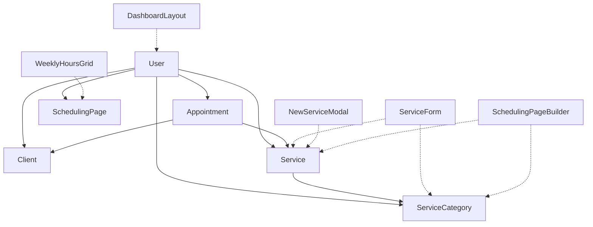

# Component Architecture Documentation

This document provides comprehensive documentation of reusable components in the scheduling application, their database relationships, and architectural patterns.

## Table of Contents
1. [Component Overview](#component-overview)
2. [Database Schema Integration](#database-schema-integration)
3. [Component Categories](#component-categories)
4. [API Endpoint Mappings](#api-endpoint-mappings)
5. [Data Flow Architecture](#data-flow-architecture)
6. [Multi-Tenant Architecture](#multi-tenant-architecture)
7. [Accessibility Compliance](#accessibility-compliance)
8. [Microservices Readiness](#microservices-readiness)

## Component Overview

### Component Hierarchy
```
App Layout
├── Navbar (public pages)
├── Footer (public pages)
└── DashboardLayout (protected pages)
    ├── DashboardSidebar
    └── Page Content
        ├── ServiceForm (reusable)
        ├── NewServiceModal
        ├── SchedulingPageBuilder
        ├── WeeklyHoursGrid
        │   └── TimeInput
        ├── NewAppointmentPanel
        └── BlockOffTimePanel
```

## Database Schema Integration

### Prisma Models and Component Relationships



### Database Models Used by Components

| Model | Fields | Components Using |
|-------|--------|------------------|
| **User** | id, name, email, businessName, phone, timezone | DashboardLayout, DashboardSidebar |
| **Service** | id, name, description, duration, price, isVisible, sortOrder, paddingTime, isPrivate, userId, categoryId | ServiceForm, NewServiceModal, SchedulingPageBuilder |
| **ServiceCategory** | id, name, description, sortOrder, isVisible, userId | ServiceForm, NewServiceModal, SchedulingPageBuilder |
| **Client** | id, name, email, phone, notes, userId | NewAppointmentPanel |
| **Appointment** | id, title, description, startTime, endTime, status, userId, clientId, serviceId | NewAppointmentPanel, BlockOffTimePanel |
| **SchedulingPage** | id, userId, isPublic, customDomain, welcomeMessage, primaryColor, secondaryColor, fontFamily, customCSS, businessHours, timezone, allowOnlineBooking, requireApproval | SchedulingPageBuilder, WeeklyHoursGrid |

## Component Categories

### 1. Layout Components

#### DashboardLayout
- **Location**: `/src/components/dashboardLayout.tsx`
- **Purpose**: Main wrapper for all dashboard pages
- **Props**:
  ```typescript
  interface DashboardLayoutProps {
    children: React.ReactNode;
    title?: string;
    subtitle?: string;
    rightContent?: React.ReactNode;
  }
  ```
- **Database Integration**: Uses NextAuth session data to fetch User information
- **Used In**: All dashboard pages (`/dashboard/*`)
- **Features**:
  - User authentication check
  - Header with user menu and logout
  - Responsive sidebar integration
  - Loading states

#### DashboardSidebar
- **Location**: `/src/components/dashboardSidebar.tsx`
- **Purpose**: Navigation sidebar for dashboard
- **Props**:
  ```typescript
  interface DashboardSidebarProps {
    mobileMenuOpen?: boolean;
    setMobileMenuOpen?: (open: boolean) => void;
  }
  ```
- **Database Integration**: Uses NextAuth session data for user context
- **Used In**: Embedded within DashboardLayout
- **Navigation Sections**:
  - Overview: Calendar, Availability
  - Notifications: Appointment Types
  - Business Settings: Profile, Billing

#### Navbar
- **Location**: `/src/components/navbar.tsx`
- **Purpose**: Public site navigation
- **Props**: None (stateless)
- **Database Integration**: None
- **Used In**: Landing, signin, signup, mission, pricing pages
- **Features**:
  - Responsive mobile menu
  - Authentication links
  - Brand logo and navigation

#### Footer
- **Location**: `/src/components/footer.tsx`
- **Purpose**: Public site footer
- **Props**: None (stateless)
- **Database Integration**: None
- **Used In**: Landing, signin, signup, mission, pricing pages
- **Features**:
  - Social media links
  - Brand information
  - Legal links

### 2. Form Components

#### ServiceForm
- **Location**: `/src/components/serviceForm.tsx`
- **Purpose**: Reusable form for creating/editing services
- **Props**:
  ```typescript
  interface ServiceFormProps {
    service?: Service | null;
    categories: ServiceCategory[];
    onSubmit: (data: ServiceFormData) => Promise<void>;
    onCancel: () => void;
    isSubmitting?: boolean;
  }
  
  interface ServiceFormData {
    name: string;
    description?: string;
    duration: number;
    price: number;
    paddingTime: number;
    isVisible: boolean;
    isPrivate: boolean;
    categoryId?: string;
    sortOrder?: number;
  }
  ```
- **Database Integration**: 
  - Reads: ServiceCategory
  - Creates: ServiceCategory (when creating new)
- **API Endpoints**: `/api/service-categories` (POST)
- **Used In**: NewServiceModal, appointment type creation/edit pages
- **Features**:
  - Form validation
  - Dynamic category creation
  - Duration and pricing options
  - Visibility and privacy settings
  - Accessibility compliant (ARIA labels, keyboard navigation)

#### TimeInput
- **Location**: `/src/components/availability/TimeInput.tsx`
- **Purpose**: Time input with 12/24 hour format support
- **Props**:
  ```typescript
  interface TimeInputProps {
    value: string;
    onChange: (value: string) => void;
    placeholder?: string;
    disabled?: boolean;
  }
  ```
- **Database Integration**: None (UI component only)
- **Used In**: WeeklyHoursGrid
- **Features**:
  - 12-hour format display with AM/PM
  - 24-hour internal format
  - Input validation
  - Auto-select on focus
  - Accessibility compliant

#### WeeklyHoursGrid
- **Location**: `/src/components/availability/WeeklyHoursGrid.tsx`
- **Purpose**: Weekly business hours configuration
- **Props**:
  ```typescript
  interface WeeklyHoursGridProps {
    businessHours: BusinessHours;
    onChange: (hours: BusinessHours) => void;
  }
  
  interface BusinessHours {
    [key: string]: {
      enabled: boolean;
      start: string;
      end: string;
    };
  }
  ```
- **Database Integration**: Updates SchedulingPage.businessHours (JSON field)
- **API Endpoints**: `/api/scheduling-page` (GET/PUT)
- **Used In**: Availability page (`/dashboard/availability`)
- **Features**:
  - Day-by-day hour configuration
  - Enable/disable days
  - Time validation
  - Accessibility compliant table structure

### 3. Modal Components

#### NewServiceModal
- **Location**: `/src/components/newServiceModal.tsx`
- **Purpose**: Modal for creating/editing services
- **Props**:
  ```typescript
  interface NewServiceModalProps {
    isOpen: boolean;
    onClose: () => void;
    service?: Service | null;
    categories: ServiceCategory[];
    onSuccess: () => void;
  }
  ```
- **Database Integration**: 
  - Creates/Updates: Service
  - Reads: ServiceCategory
- **API Endpoints**: `/api/services` (POST/PUT)
- **Used In**: Appointment Types page
- **Features**:
  - Modal overlay and focus trapping
  - Form validation
  - Success/error handling
  - Embeds ServiceForm component

#### NewAppointmentPanel
- **Location**: `/src/components/newAppointmentPanel.tsx`
- **Purpose**: Slide-out panel for creating appointments
- **Props**:
  ```typescript
  interface NewAppointmentPanelProps {
    isOpen: boolean;
    onClose: () => void;
  }
  ```
- **Database Integration**: Will create Appointment records
- **Used In**: Calendar page (`/dashboard/calendar`)
- **Features**:
  - Slide-out animation
  - Appointment form (to be implemented)
  - Client selection
  - Service selection

#### BlockOffTimePanel
- **Location**: `/src/components/blockOffTimePanel.tsx`
- **Purpose**: Slide-out panel for blocking calendar time
- **Props**:
  ```typescript
  interface BlockOffTimePanelProps {
    isOpen: boolean;
    onClose: () => void;
  }
  ```
- **Database Integration**: Will create blocked time records
- **Used In**: Calendar page (`/dashboard/calendar`)
- **Features**:
  - Slide-out animation
  - Time blocking form (to be implemented)
  - Recurring block options

### 4. Business Logic Components

#### SchedulingPageBuilder
- **Location**: `/src/components/schedulingPageBuilder.tsx`
- **Purpose**: Comprehensive scheduling page configuration
- **Props**: None (self-contained)
- **Database Integration**:
  - Reads: Service, ServiceCategory, SchedulingPage
  - Updates: SchedulingPage
- **API Endpoints**: 
  - `/api/services` (GET)
  - `/api/service-categories` (GET)
  - `/api/scheduling-page` (GET/PUT)
- **Used In**: Scheduling page (`/dashboard/scheduling`)
- **Features**:
  - Service visibility management
  - Page customization options
  - Theme configuration
  - Business hours integration

## API Endpoint Mappings

### Service Management
| Endpoint | Method | Component | Purpose |
|----------|--------|-----------|---------|
| `/api/services` | GET | SchedulingPageBuilder | Fetch user's services |
| `/api/services` | POST | ServiceForm, NewServiceModal | Create new service |
| `/api/services/[id]` | PUT | ServiceForm, NewServiceModal | Update service |
| `/api/services/[id]` | DELETE | NewServiceModal | Delete service |

### Service Categories
| Endpoint | Method | Component | Purpose |
|----------|--------|-----------|---------|
| `/api/service-categories` | GET | ServiceForm, SchedulingPageBuilder | Fetch categories |
| `/api/service-categories` | POST | ServiceForm | Create new category |
| `/api/service-categories/[id]` | PUT | ServiceForm | Update category |
| `/api/service-categories/[id]` | DELETE | ServiceForm | Delete category |

### Scheduling Configuration
| Endpoint | Method | Component | Purpose |
|----------|--------|-----------|---------|
| `/api/scheduling-page` | GET | SchedulingPageBuilder, WeeklyHoursGrid | Fetch page settings |
| `/api/scheduling-page` | PUT | SchedulingPageBuilder, WeeklyHoursGrid | Update settings |

### Public API
| Endpoint | Method | Component | Purpose |
|----------|--------|-----------|---------|
| `/api/public/[userId]/services` | GET | Public booking page | Fetch visible services |
| `/api/public/[userId]/page` | GET | Public booking page | Fetch page configuration |

## Data Flow Architecture

### Service Management Flow
```
User Input (ServiceForm)
    ↓
Form Validation
    ↓
API Request (/api/services)
    ↓
Prisma Client (with userId filter)
    ↓
SQLite Database
    ↓
Response with Created/Updated Service
    ↓
UI Update & Modal Close
```

### Business Hours Configuration Flow
```
User Input (WeeklyHoursGrid → TimeInput)
    ↓
Local State Update
    ↓
onChange Callback
    ↓
API Request (/api/scheduling-page)
    ↓
JSON Serialization (businessHours)
    ↓
Prisma Client Update
    ↓
Database Persistence
```

### Authentication Flow Integration
```
NextAuth Session
    ↓
Session Provider (app/layout.tsx)
    ↓
useSession() Hook (components)
    ↓
User ID for Tenant Isolation
    ↓
Database Queries (filtered by userId)
```

## Multi-Tenant Architecture

### Tenant Isolation Patterns

All components follow strict tenant isolation:

1. **Database Queries**: Always include `userId` filter
   ```typescript
   const services = await prisma.service.findMany({
     where: { userId: session.user.id },
     include: { category: true }
   });
   ```

2. **API Route Protection**: Verify ownership before operations
   ```typescript
   const service = await prisma.service.findFirst({
     where: { id: serviceId, userId: session.user.id }
   });
   if (!service) {
     return NextResponse.json({ error: 'Not found' }, { status: 404 });
   }
   ```

3. **Component Data Scoping**: Components only receive user's data
   ```typescript
   // In page component
   const categories = await prisma.serviceCategory.findMany({
     where: { userId: session.user.id }
   });
   ```

### Security Considerations

- **No Cross-Tenant Data Exposure**: Components never display other users' data
- **Ownership Verification**: All mutations verify resource ownership
- **Session-Based Filtering**: All queries include session.user.id
- **Input Validation**: Forms validate data before submission

## Accessibility Compliance

### WCAG 2.2 Level AA Implementation

#### ServiceForm Component
- ✅ Proper form labeling with `<label>` elements
- ✅ ARIA attributes (`aria-describedby`, `aria-label`)
- ✅ Keyboard navigation support
- ✅ Screen reader support with descriptive text
- ✅ Focus management and indicators
- ✅ Color contrast compliance

#### TimeInput Component
- ✅ Semantic input with proper labeling
- ✅ Auto-select functionality for ease of use
- ✅ Clear placeholder text
- ✅ Visual focus indicators
- ✅ Screen reader announcements

#### WeeklyHoursGrid Component
- ✅ Semantic table structure with headers
- ✅ Proper field associations
- ✅ Keyboard navigation between inputs
- ✅ Clear day/time relationships

#### Modal Components
- ⚠️ **Need Focus Trapping**: Implement proper modal focus management
- ⚠️ **Need ARIA Attributes**: Add `role="dialog"`, `aria-modal="true"`
- ⚠️ **Need Escape Key Handling**: Implement keyboard dismissal

#### Navigation Components
- ✅ Semantic navigation structure
- ✅ Skip links for main content
- ✅ Proper heading hierarchy
- ✅ Responsive design support

### Accessibility Improvements Needed

1. **Modal Focus Trapping**: Implement focus cycling within modals
2. **ARIA Live Regions**: Add status announcements for dynamic content
3. **Error Message Association**: Link form errors with fields using `aria-describedby`
4. **Loading State Announcements**: Screen reader feedback for async operations

## Microservices Readiness

### Service Decomposition Analysis

#### User Management Service
**Components**: DashboardLayout, DashboardSidebar, Navbar, Footer
- **Readiness**: ✅ High
- **Dependencies**: NextAuth session management
- **API Surface**: User profile, authentication, business settings

#### Service Catalog Service
**Components**: ServiceForm, NewServiceModal, SchedulingPageBuilder
- **Readiness**: ✅ High
- **Dependencies**: Service and ServiceCategory models
- **API Surface**: CRUD operations for services and categories

#### Scheduling Configuration Service
**Components**: WeeklyHoursGrid, TimeInput, SchedulingPageBuilder
- **Readiness**: ✅ Medium
- **Dependencies**: SchedulingPage model
- **API Surface**: Business hours, page customization

#### Appointment Management Service
**Components**: NewAppointmentPanel, BlockOffTimePanel
- **Readiness**: ⚠️ Low (UI only, business logic not implemented)
- **Dependencies**: Appointment, Client models
- **API Surface**: Appointment CRUD, calendar management

### Service Extraction Roadmap

1. **Phase 1**: Extract User Management Service
   - Move authentication logic
   - Create user profile API
   - Update component dependencies

2. **Phase 2**: Extract Service Catalog Service
   - Move service/category models
   - Create dedicated service APIs
   - Update ServiceForm and related components

3. **Phase 3**: Extract Scheduling Service
   - Move business hours logic
   - Create scheduling configuration API
   - Update WeeklyHoursGrid component

4. **Phase 4**: Extract Appointment Service
   - Complete appointment management implementation
   - Move appointment models
   - Create booking APIs

### Inter-Service Communication Patterns

```typescript
// Future service communication example
interface ServiceCatalogAPI {
  getServices(userId: string): Promise<Service[]>;
  createService(userId: string, data: ServiceData): Promise<Service>;
  updateService(userId: string, id: string, data: ServiceData): Promise<Service>;
  deleteService(userId: string, id: string): Promise<void>;
}

// Component usage
const ServiceFormContainer = () => {
  const serviceCatalog = useServiceCatalogAPI();
  
  const handleSubmit = async (data: ServiceFormData) => {
    await serviceCatalog.createService(userId, data);
  };
  
  return <ServiceForm onSubmit={handleSubmit} />;
};
```

## Component Development Guidelines

### 1. New Component Checklist
- [ ] Props interface with TypeScript
- [ ] Database integration with tenant isolation
- [ ] WCAG 2.2 Level AA compliance
- [ ] Error handling and loading states
- [ ] Responsive design
- [ ] Unit tests (when test framework added)

### 2. Database Integration Standards
```typescript
// Always include userId in queries
const data = await prisma.model.findMany({
  where: { userId: session.user.id }
});

// Verify ownership for mutations
const resource = await prisma.model.findFirst({
  where: { id, userId: session.user.id }
});
if (!resource) throw new Error('Not found');
```

### 3. Accessibility Standards
```typescript
// Proper form labeling
<label htmlFor="field-id" className="...">
  Field Label <span className="text-red-500">*</span>
</label>
<input
  id="field-id"
  aria-describedby="field-help"
  className="..."
/>
<span id="field-help" className="sr-only">
  Help text for screen readers
</span>
```

### 4. Component Props Pattern
```typescript
interface ComponentProps {
  // Required props first
  data: RequiredData;
  onSubmit: (data: FormData) => Promise<void>;
  
  // Optional props with defaults
  isSubmitting?: boolean;
  className?: string;
  
  // Event handlers
  onCancel?: () => void;
  onChange?: (value: any) => void;
}
```

## Future Enhancements

### Short Term (Next 2-4 weeks)
1. **Complete accessibility fixes** for modal components
2. **Add form validation** with better error handling
3. **Implement loading states** for all async operations
4. **Add unit tests** for all components

### Medium Term (1-3 months)
1. **Extract Service Catalog microservice**
2. **Implement appointment management** business logic
3. **Add internationalization** support
4. **Performance optimization** with React.memo and useMemo

### Long Term (3-6 months)
1. **Complete microservices decomposition**
2. **Database partitioning** implementation
3. **Real-time updates** with WebSocket integration
4. **Advanced accessibility features** (keyboard shortcuts, voice navigation)

---

*Last updated: January 2025*
*For questions or updates to this documentation, please update this file and notify the development team.*