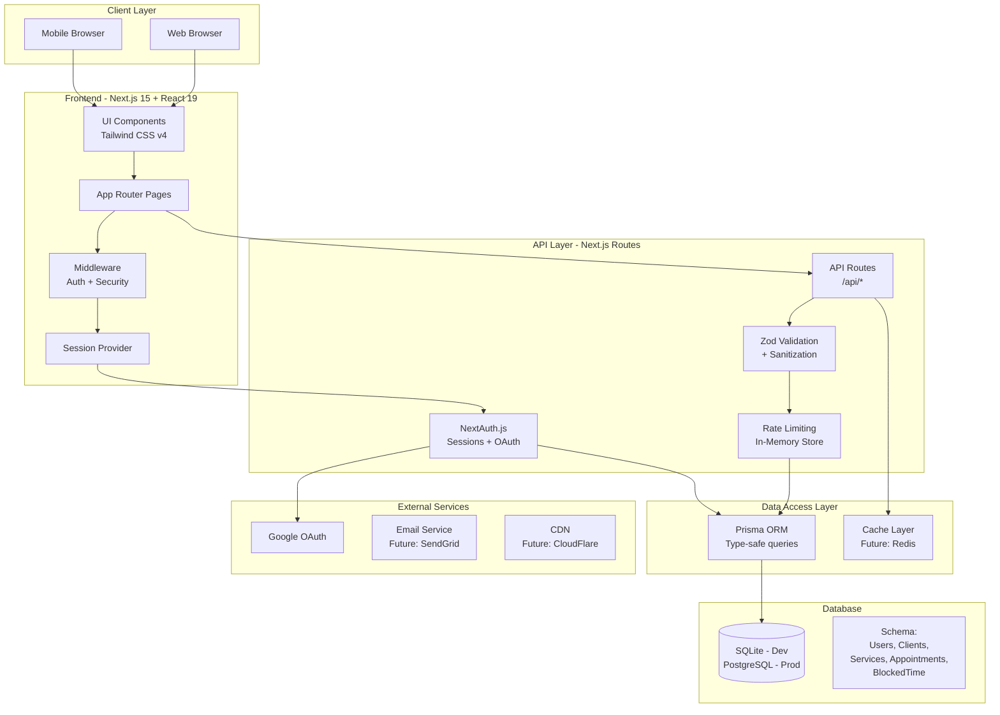

# 📊 PROJECT STATUS

> **Last Updated**: 2025-08-08 (August 8, 2025)  
> **Current Sprint**: Calendar Implementation & Security Hardening  
> **Project Phase**: Alpha Development

## 🏗️ System Architecture



## 📍 Last Session Summary

**Date**: August 8, 2025  
**Duration**: Extended session  
**Focus**: Calendar UI Enhancement & Mock Data Creation

### What Was Accomplished
1. ✅ **Enhanced Calendar View** 
   - Changed from 30-minute to hourly time slots
   - Implemented precise minute positioning (e.g., 2:15-2:45 PM)
   - Added appointment overlap detection
   - Color-coded appointment statuses

2. ✅ **Created Secure API Endpoints**
   - `/api/appointments` - Full CRUD with tenant isolation
   - `/api/appointments/[id]` - Individual appointment operations
   - Conflict detection for double-booking prevention
   - Input validation with Zod schemas

3. ✅ **Security Audit & Fixes**
   - Fixed service category deletion vulnerability
   - Implemented database connection pooling
   - Added rate limiting middleware
   - Created SECURITY.md documentation
   - Fixed CORS configuration

4. ✅ **Mock Data Generation**
   - Created seeder script with 5 clients, 5 services, 8 appointments
   - Strategic appointment times to test precise positioning
   - Multiple appointment statuses for testing

### Issues Resolved
- Fixed TypeScript linting errors with `any` types
- Corrected Prisma import patterns (named vs default imports)
- Resolved missing useEffect dependencies

### Next Steps Identified
- Implement appointment editing UI (click handlers exist)
- Add drag-and-drop rescheduling
- Complete NewAppointmentPanel integration
- Test with production data

## 🎯 Current Sprint Items

### Active Focus Areas
1. **Calendar Functionality** [80% Complete]
   - ✅ Week view with hourly slots
   - ✅ Precise time positioning
   - ✅ API integration
   - 🚧 Edit appointment UI
   - 📋 Drag-and-drop rescheduling

2. **Security Hardening** [90% Complete]
   - ✅ Multi-tenant data isolation
   - ✅ Input validation
   - ✅ Rate limiting
   - ✅ Security headers
   - 🚧 Implement CSP headers

## 📈 Feature Status Dashboard

### ✅ Completed Features
- [x] User authentication (Email/Password + Google OAuth)
- [x] Dashboard layout and navigation
- [x] Service management CRUD
- [x] Service categories
- [x] Client management
- [x] Scheduling page builder
- [x] Business hours configuration
- [x] Calendar week view with precise positioning
- [x] Appointment API with conflict detection
- [x] Mock data seeder for testing
- [x] Security audit and fixes
- [x] Rate limiting implementation

### 🚧 In Progress
- [ ] Appointment editing UI (50%)
- [ ] Calendar month view (20%)
- [ ] Email notifications (10%)
- [ ] Public booking page enhancements (30%)

### 📋 Planned Features
- [ ] Appointment reminders
- [ ] Recurring appointments
- [ ] Payment integration (Stripe)
- [ ] Analytics dashboard
- [ ] Export functionality (CSV, PDF)
- [ ] Mobile app (React Native)
- [ ] Webhook integrations
- [ ] Custom branding options
- [ ] Team member management
- [ ] Resource booking

### 🐛 Known Issues
1. **Calendar**: Time slot click handler needs panel integration
2. **Auth**: Password reset flow not implemented
3. **UI**: Mobile responsiveness needs improvement on booking page
4. **Performance**: N+1 queries in public services endpoint
5. **Accessibility**: Modal focus trapping incomplete

## 📝 Recent Changes Log

| Date | Feature | Files Modified | Notes |
|------|---------|---------------|-------|
| 2025-08-08 | Mock Data Creation | `scripts/seed-mock-data.js` | Added comprehensive test data |
| 2025-08-08 | Calendar Enhancement | `src/app/calendar/page.tsx` | Hourly slots, precise positioning |
| 2025-08-08 | Appointment APIs | `src/app/api/appointments/*` | Full CRUD with security |
| 2025-08-08 | Calendar Utils | `src/lib/calendar-utils.ts` | Helper functions for time calc |
| 2025-08-08 | Security Audit | Multiple files | Fixed vulnerabilities, added docs |
| 2025-08-07 | Rate Limiting | `src/lib/rate-limit.ts`, `src/middleware.ts` | Prevent API abuse |
| 2025-08-07 | Security Headers | `src/middleware.ts` | CSP, X-Frame-Options, etc. |
| 2025-08-07 | Validation Layer | `src/lib/validations.ts` | Zod schemas for all models |
| 2025-08-07 | Connection Pooling | `src/lib/prisma.ts` | Singleton pattern for Prisma |
| 2025-08-07 | Service Categories | `src/app/api/service-categories/*` | Fixed security vulnerability |

## 🔧 Technical Debt & TODOs

### High Priority
1. **Database**: Add composite indexes for tenant-scoped queries
2. **Security**: Implement full CSP headers
3. **Performance**: Optimize N+1 queries in public APIs
4. **Testing**: Add unit and integration tests
5. **Monitoring**: Implement error tracking (Sentry)

### Medium Priority
1. **Code**: Clean up remaining TypeScript `any` types
2. **UI**: Improve mobile responsiveness
3. **API**: Standardize error response format
4. **Docs**: API documentation (OpenAPI/Swagger)
5. **Build**: Optimize bundle size

### Low Priority
1. **Refactor**: Extract common UI patterns to components
2. **Style**: Create consistent color palette system
3. **i18n**: Add internationalization support
4. **A11y**: Complete WCAG 2.2 AA compliance
5. **DevX**: Add pre-commit hooks

## 🎓 Key Architectural Decisions

| Decision | Rationale | Date |
|----------|-----------|------|
| **Next.js 15 App Router** | Modern React patterns, better performance, built-in API routes | 2025-01 |
| **Prisma ORM** | Type safety, excellent DX, migration management | 2025-01 |
| **SQLite for Dev** | Zero config, easy local development | 2025-01 |
| **PostgreSQL for Prod** | Scalability, row-level security, partitioning support | 2025-01 |
| **Tailwind CSS v4** | Utility-first, consistent design system, smaller bundles | 2025-01 |
| **NextAuth.js** | Robust auth solution, OAuth support, database sessions | 2025-01 |
| **Zod Validation** | Runtime type checking, schema validation | 2025-08 |
| **In-Memory Rate Limiting** | Simple for MVP, can upgrade to Redis later | 2025-08 |
| **Hourly Calendar Grid** | Better UX for appointment scheduling, cleaner view | 2025-08 |

## 💡 Lessons Learned

1. **Prisma Imports**: Always use named imports `{ prisma }` not default imports
2. **Tenant Isolation**: Every query must filter by `userId` for multi-tenancy
3. **TypeScript**: Avoid `any` types - use `Record<string, unknown>` for objects
4. **Calendar Positioning**: Pixel-based calculations work best for precise times
5. **Security**: Never trust client input - always validate and sanitize
6. **Performance**: Connection pooling critical for database-heavy operations

## 🚀 Deployment Readiness

### ✅ Ready
- Core authentication flow
- Basic appointment scheduling
- Service management
- Client management

### 🚧 Needs Work
- Environment variable management
- Database migrations for production
- Error monitoring setup
- Performance optimization
- Load testing

### 📋 Not Started
- CI/CD pipeline
- Automated testing
- Backup strategies
- Monitoring & alerting
- Documentation site

## 📞 Quick Links

- **Local Dev**: http://localhost:3000
- **Calendar**: http://localhost:3000/calendar
- **Dashboard**: http://localhost:3000/dashboard
- **Database GUI**: `npx prisma studio`
- **GitHub Issues**: [Add your repo URL]
- **Design Mockups**: [Add Figma/design links]

## 🔄 Update Template

```markdown
## 📍 Last Session Summary

**Date**: [DATE]  
**Duration**: [TIME]  
**Focus**: [MAIN FOCUS]

### What Was Accomplished
1. ✅ **[Feature Name]**
   - [Detail 1]
   - [Detail 2]

### Issues Resolved
- [Issue description and fix]

### Next Steps Identified
- [Next task 1]
- [Next task 2]
```

---

> **Note for Claude**: Always read this file at the start of a session and update it at the end. This ensures continuity across sessions and maintains project context.