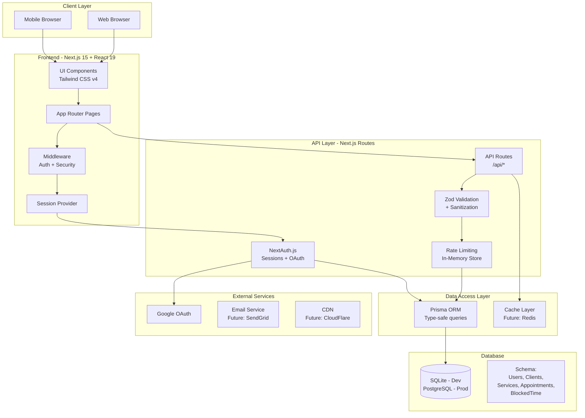

# 📊 PROJECT STATUS

> **Last Updated**: 2025-08-13 (August 13, 2025)  
> **Current Sprint**: Calendar Bug Fixes & Business Logic Enforcement  
> **Project Phase**: Alpha Development - Stability Focus

## 🏗️ System Architecture



## 📍 Last Session Summary

**Date**: August 15, 2025  
**Duration**: Extended session  
**Focus**: Complete Calendar & Time Selection Feature + Business Hours Integration

### What Was Accomplished
1. ✅ **Complete Calendar & Time Selection Implementation**
   - Built interactive Calendar component with month navigation and date selection
   - Created availability API endpoint (`/api/public/[userId]/availability`) for real-time time slot checking
   - Implemented service duration-based time slot generation (15-minute intervals)
   - Added conflict detection with existing appointments for accurate availability

2. ✅ **Complete Booking Flow Integration**
   - Extended public booking page with Categories → Services → Calendar navigation
   - Added service summary display during date/time selection
   - Implemented proper state management across all booking views
   - Integrated Calendar component into scheduling page builder preview

3. ✅ **Availability API System**
   - Fixed critical type error in availability API (removed invalid `.toLocaleLowerCase()`)
   - Added robust business hours parsing with JSON string handling
   - Implemented comprehensive error handling and fallback to default hours
   - Added timezone support and proper date handling

4. ✅ **Session Context & Preview Fixes**
   - Added session context to scheduling page builder component
   - Fixed preview mode using actual user ID instead of "preview-user"
   - Updated booking URLs and embed codes to use real user data
   - Added loading states to prevent invalid API calls

5. ✅ **Business Hours Calendar Integration - CRITICAL FIX**
   - Created `/api/public/[userId]/business-hours` endpoint for calendar business hours fetching
   - Added `isClosedDate()` helper function to detect closed business days
   - Updated date selection logic to prevent clicking on closed days (Sunday/Saturday)
   - Implemented proper visual styling - closed days now appear grayed out like past dates
   - Added loading states for business hours fetching

### Issues Resolved
- **RESOLVED**: Calendar closed day selection issue - users can no longer select unavailable business days
- **RESOLVED**: Availability API type errors preventing proper time slot loading
- **RESOLVED**: Preview component using fake user ID causing 404 errors
- **RESOLVED**: Inconsistent component behavior between preview and live booking
- **RESOLVED**: Missing business hours enforcement in calendar UI

### ✅ CRITICAL ISSUE RESOLVED
**✅ CALENDAR CLOSED DAY SELECTION FIXED**
- Closed business days (Sunday/Saturday) now appear grayed out and are non-clickable
- Visual consistency with past dates - same styling for all unavailable dates
- Users can no longer accidentally select dates when business is closed
- Eliminates confusion of seeing "No available times" after clicking closed days
- Calendar now perfectly respects business hours configuration

### Next Steps Identified
- Implement booking confirmation flow after date/time selection
- Add calendar drag-and-drop rescheduling functionality
- Enhance mobile responsiveness for calendar interface
- Add calendar keyboard navigation for accessibility
- Implement recurring appointment scheduling

## 🎯 Current Sprint Items

### Active Focus Areas
1. **Scheduling Page Builder** [75% Complete]
   - ✅ Clean standalone layout design
   - ✅ Navigation UI consistency
   - ✅ Font family selector with real-time preview
   - ✅ Preview tab streamlined
   - 🚧 Color picker functionality
   - 🚧 Settings tab implementation
   - 📋 Link generation and sharing

2. **Calendar Functionality** [95% Complete]
   - ✅ Week view with hourly slots
   - ✅ Precise time positioning
   - ✅ API integration
   - ✅ NewAppointmentPanel with client form
   - ✅ Complete Calendar & Time selection component
   - ✅ Business hours integration with visual enforcement
   - ✅ Categories → Services → Calendar booking flow
   - 📋 Drag-and-drop rescheduling
   - 📋 Booking confirmation flow

3. **UI/UX Standards & Accessibility** [95% Complete]
   - ✅ Cursor-pointer on all interactive elements
   - ✅ WCAG 2.2 Level AA compliance for forms
   - ✅ Consistent styling across pages
   - ✅ Documentation in CLAUDE.md
   - 🚧 Complete modal focus trapping

4. **Security Hardening** [90% Complete]
   - ✅ Multi-tenant data isolation
   - ✅ Input validation
   - ✅ Rate limiting
   - ✅ Security headers
   - 🚧 Implement CSP headers

## 📈 Feature Status Dashboard

### ✅ Completed Features
- [x] User authentication (Email/Password + Google OAuth)
- [x] Dashboard layout and navigation
- [x] Service management CRUD
- [x] Service categories
- [x] Client management
- [x] Scheduling page builder foundation
- [x] Business hours configuration
- [x] Calendar week view with precise positioning
- [x] Appointment API with conflict detection
- [x] Mock data seeder for testing
- [x] Security audit and fixes
- [x] Rate limiting implementation
- [x] NewAppointmentPanel floating overlay
- [x] Client form with validation
- [x] UI/UX standards documentation
- [x] Cursor-pointer interactive elements
- [x] Clean scheduling page layout
- [x] Font family selector with real-time preview
- [x] Navigation UI consistency across pages
- [x] WCAG 2.2 Level AA form compliance
- [x] Complete Calendar & Time Selection component
- [x] Business hours calendar integration
- [x] Complete booking flow (Categories → Services → Calendar)
- [x] Availability API system with conflict detection
- [x] Visual enforcement of business hours in calendar UI

### 🚧 In Progress
- [ ] Scheduling page color picker functionality (0%)
- [ ] Scheduling page settings tab (0%)
- [ ] Booking confirmation flow (0%)
- [ ] Client autocomplete search (0%)
- [ ] Appointment drag-and-drop rescheduling (0%)
- [ ] Calendar month view (20%)
- [ ] Email notifications (10%)

### 📋 Planned Features
- [ ] Appointment reminders
- [ ] Recurring appointments
- [ ] Payment integration (Stripe)
- [ ] Analytics dashboard
- [ ] Export functionality (CSV, PDF)
- [ ] Mobile app (React Native)
- [ ] Webhook integrations
- [ ] Custom branding options
- [ ] Team member management
- [ ] Resource booking

### 🐛 Known Issues
1. **Scheduling Page**: Color picker inputs need real-time preview functionality
2. **Auth**: Password reset flow not implemented
3. **UI**: Mobile responsiveness needs improvement on booking page
4. **Performance**: N+1 queries in public services endpoint
5. **Accessibility**: Modal focus trapping incomplete
6. **NewAppointmentPanel**: Client form not yet connected to API
7. **Booking Flow**: Confirmation step after date/time selection not implemented

## 📝 Recent Changes Log

| Date | Feature | Files Modified | Notes |
|------|---------|---------------|-------|
| 2025-08-15 | **MAJOR FEATURE**: Complete Calendar & Time Selection | `src/components/Calendar.tsx`, `src/app/api/public/[userId]/availability/route.ts`, `src/app/api/public/[userId]/business-hours/route.ts` | ✅ **COMPLETED**: Full calendar implementation with business hours integration, visual closed-day enforcement, and complete booking flow |
| 2025-08-15 | **CRITICAL FIX**: Calendar Closed Day Selection | `src/components/Calendar.tsx` | ✅ **RESOLVED**: Closed business days now appear grayed out and non-clickable, preventing user confusion |
| 2025-08-15 | Booking Flow Integration | `src/app/book/[userId]/page.tsx`, `src/components/schedulingPageBuilder.tsx` | ✅ Categories → Services → Calendar navigation with state management |
| 2025-08-15 | Availability API System | `src/app/api/public/[userId]/availability/route.ts` | ✅ Real-time time slot checking with conflict detection and business hours validation |
| 2025-08-15 | Session Context Fixes | `src/components/schedulingPageBuilder.tsx` | ✅ Fixed preview mode to use actual user ID instead of "preview-user" |
| 2025-08-13 | **CRITICAL BUG FIX**: Appointment Column Positioning | `src/app/calendar/page.tsx`, `CLAUDE.md`, `CRITICAL_BUG_REPORT_2025_08_13.md` | ✅ **RESOLVED**: Fixed appointments appearing on Saturday (closed day). Root cause: CSS overlap calculations shifted appointments between day columns. Implemented safe positioning pattern. |
| 2025-08-13 | Business Hours Enforcement | `src/app/calendar/page.tsx`, `src/app/api/appointments/route.ts`, `scripts/seed-mock-data-safe.js` | ✅ Business logic working correctly - appointments filtered properly |
| 2025-08-13 | Calendar Layout Fixes | `src/app/calendar/page.tsx` | Fixed whitespace and positioning issues |
| 2025-08-10 | Font Family Selector | `src/components/schedulingPageBuilder.tsx` | WCAG compliant with real-time preview |
| 2025-08-10 | Scheduling Page Layout | `src/app/dashboard/scheduling/page.tsx`, `src/components/schedulingPageBuilder.tsx` | Clean standalone layout |
| 2025-08-10 | Navigation UI Consistency | `src/components/schedulingPageBuilder.tsx` | Matched clients page styling |
| 2025-08-10 | Preview Tab Cleanup | `src/components/schedulingPageBuilder.tsx` | Removed service categories section |
| 2025-08-09 | UI/UX Standards | `CLAUDE.md` | Added cursor-pointer requirements |
| 2025-08-09 | Interactive Elements | `src/app/calendar/page.tsx`, `src/components/newAppointmentPanel.tsx` | Added cursor-pointer to all clickable |
| 2025-08-09 | Client Form | `src/components/newAppointmentPanel.tsx` | Added expandable form with validation |
| 2025-08-09 | Panel Positioning | `src/components/newAppointmentPanel.tsx` | Fixed floating overlay behavior |
| 2025-08-08 | Mock Data Creation | `scripts/seed-mock-data.js` | Added comprehensive test data |
| 2025-08-08 | Calendar Enhancement | `src/app/calendar/page.tsx` | Hourly slots, precise positioning |
| 2025-08-08 | Appointment APIs | `src/app/api/appointments/*` | Full CRUD with security |
| 2025-08-08 | Calendar Utils | `src/lib/calendar-utils.ts` | Helper functions for time calc |
| 2025-08-08 | Security Audit | Multiple files | Fixed vulnerabilities, added docs |
| 2025-08-07 | Rate Limiting | `src/lib/rate-limit.ts`, `src/middleware.ts` | Prevent API abuse |
| 2025-08-07 | Security Headers | `src/middleware.ts` | CSP, X-Frame-Options, etc. |
| 2025-08-07 | Validation Layer | `src/lib/validations.ts` | Zod schemas for all models |
| 2025-08-07 | Connection Pooling | `src/lib/prisma.ts` | Singleton pattern for Prisma |
| 2025-08-07 | Service Categories | `src/app/api/service-categories/*` | Fixed security vulnerability |

## 🔧 Technical Debt & TODOs

### High Priority
1. **Database**: Add composite indexes for tenant-scoped queries
2. **Security**: Implement full CSP headers
3. **Performance**: Optimize N+1 queries in public APIs
4. **Testing**: Add unit and integration tests
5. **Monitoring**: Implement error tracking (Sentry)

### Medium Priority
1. **Code**: Clean up remaining TypeScript `any` types
2. **UI**: Improve mobile responsiveness
3. **API**: Standardize error response format
4. **Docs**: API documentation (OpenAPI/Swagger)
5. **Build**: Optimize bundle size

### Low Priority
1. **Refactor**: Extract common UI patterns to components
2. **Style**: Create consistent color palette system
3. **i18n**: Add internationalization support
4. **A11y**: Complete WCAG 2.2 AA compliance
5. **DevX**: Add pre-commit hooks

## 🎓 Key Architectural Decisions

| Decision | Rationale | Date |
|----------|-----------|------|
| **Next.js 15 App Router** | Modern React patterns, better performance, built-in API routes | 2025-01 |
| **Prisma ORM** | Type safety, excellent DX, migration management | 2025-01 |
| **SQLite for Dev** | Zero config, easy local development | 2025-01 |
| **PostgreSQL for Prod** | Scalability, row-level security, partitioning support | 2025-01 |
| **Tailwind CSS v4** | Utility-first, consistent design system, smaller bundles | 2025-01 |
| **NextAuth.js** | Robust auth solution, OAuth support, database sessions | 2025-01 |
| **Zod Validation** | Runtime type checking, schema validation | 2025-08 |
| **In-Memory Rate Limiting** | Simple for MVP, can upgrade to Redis later | 2025-08 |
| **Hourly Calendar Grid** | Better UX for appointment scheduling, cleaner view | 2025-08 |

## 💡 Lessons Learned

1. **Prisma Imports**: Always use named imports `{ prisma }` not default imports
2. **Tenant Isolation**: Every query must filter by `userId` for multi-tenancy
3. **TypeScript**: Avoid `any` types - use `Record<string, unknown>` for objects
4. **Calendar Positioning**: Pixel-based calculations work best for precise times
5. **Security**: Never trust client input - always validate and sanitize
6. **Performance**: Connection pooling critical for database-heavy operations

## 🚀 Deployment Readiness

### ✅ Ready
- Core authentication flow
- Complete appointment booking flow (Categories → Services → Calendar)
- Business hours enforcement and visual integration
- Service management
- Client management
- Public booking page with calendar functionality
- Scheduling page builder with preview

### 🚧 Needs Work
- Booking confirmation flow
- Environment variable management
- Database migrations for production
- Error monitoring setup
- Performance optimization
- Load testing

### 📋 Not Started
- CI/CD pipeline
- Automated testing
- Backup strategies
- Monitoring & alerting
- Documentation site

## 📞 Quick Links

- **Local Dev**: http://localhost:3000
- **Calendar**: http://localhost:3000/calendar
- **Dashboard**: http://localhost:3000/dashboard
- **Database GUI**: `npx prisma studio`
- **GitHub Issues**: [Add your repo URL]
- **Design Mockups**: [Add Figma/design links]

## 🔄 Update Template

```markdown
## 📍 Last Session Summary

**Date**: [DATE]  
**Duration**: [TIME]  
**Focus**: [MAIN FOCUS]

### What Was Accomplished
1. ✅ **[Feature Name]**
   - [Detail 1]
   - [Detail 2]

### Issues Resolved
- [Issue description and fix]

### Next Steps Identified
- [Next task 1]
- [Next task 2]
```

---

> **Note for Claude**: Always read this file at the start of a session and update it at the end. This ensures continuity across sessions and maintains project context.