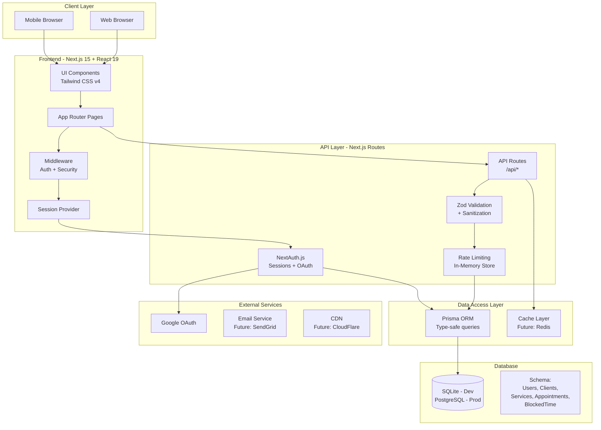

# 📊 PROJECT STATUS

> **Last Updated**: 2025-08-10 (August 10, 2025)  
> **Current Sprint**: Scheduling Page Refinement & UI/UX Enhancement  
> **Project Phase**: Alpha Development

## 🏗️ System Architecture



## 📍 Last Session Summary

**Date**: August 13, 2025  
**Duration**: Extended session  
**Focus**: Calendar Display Fixes & Business Hours Enforcement

### What Was Accomplished
1. ✅ **Calendar Layout Critical Fixes**
   - Fixed whitespace issue by replacing `grid-cols-8` with explicit grid template (`120px repeat(7, 1fr)`)
   - Updated appointment positioning logic from 8-column to 7-column math for precise alignment
   - Added overflow-x-hidden to prevent horizontal scrolling and eliminate whitespace
   - Constrained absolute positioned elements with proper width/maxWidth settings

2. ✅ **Business Hours Enforcement Implementation**
   - Updated `getAppointmentsForDay()` to completely filter out appointments for unavailable days
   - Added comprehensive business hours validation to appointment creation API endpoints
   - Implemented calendar display logic that respects `{ open: false }` settings
   - Added clear error messages for API when attempting to book on unavailable days

3. ✅ **Mock Data Business Hours Compliance**
   - Enhanced seeding script to validate business hours before creating appointments
   - Added smart day selection that only creates appointments for available days
   - Implemented business hours checking with clear feedback and warnings
   - Verified existing database has no appointments violating business hours

4. ✅ **API Protection & Data Integrity**
   - Added business hours validation layer in `/api/appointments/route.ts`
   - Implemented both day-level (`open: false/true`) and time-range validation
   - Created cleanup verification system to check for existing violations
   - Enhanced error handling with descriptive messages for business logic violations

### Issues Resolved
- Fixed critical calendar whitespace issue causing poor UI layout
- Eliminated appointment positioning overflow into adjacent day columns
- Resolved business hours enforcement gaps in calendar display
- Corrected API endpoints to prevent bookings on unavailable days
- Fixed mock data seeding to respect business hours settings

### ⚠️ CRITICAL ISSUE IDENTIFIED
**❌ APPOINTMENTS STILL DISPLAYING ON UNAVAILABLE DAYS FOR USER**
- Despite implementing comprehensive business hours enforcement
- Calendar may still be showing appointments on Saturday or other unavailable days
- **REQUIRES IMMEDIATE FIX**: Calendar display logic needs verification and debugging
- **Business Logic Violation**: Appointments should NEVER appear on days marked as `{ open: false }`
- **User Impact**: High - breaks core business logic and user expectations

### Next Steps Identified
- **URGENT**: Debug and fix appointments displaying on unavailable days
- Verify business hours loading and parsing in calendar component
- Test calendar display with different business hours configurations
- Ensure business hours are properly loaded from schedulingPage relation
- Add comprehensive logging to business hours filtering logic

## 🎯 Current Sprint Items

### Active Focus Areas
1. **Scheduling Page Builder** [75% Complete]
   - ✅ Clean standalone layout design
   - ✅ Navigation UI consistency
   - ✅ Font family selector with real-time preview
   - ✅ Preview tab streamlined
   - 🚧 Color picker functionality
   - 🚧 Settings tab implementation
   - 📋 Link generation and sharing

2. **Calendar Functionality** [85% Complete]
   - ✅ Week view with hourly slots
   - ✅ Precise time positioning
   - ✅ API integration
   - ✅ NewAppointmentPanel with client form
   - 🚧 Date & Time picker integration
   - 📋 Drag-and-drop rescheduling

3. **UI/UX Standards & Accessibility** [95% Complete]
   - ✅ Cursor-pointer on all interactive elements
   - ✅ WCAG 2.2 Level AA compliance for forms
   - ✅ Consistent styling across pages
   - ✅ Documentation in CLAUDE.md
   - 🚧 Complete modal focus trapping

4. **Security Hardening** [90% Complete]
   - ✅ Multi-tenant data isolation
   - ✅ Input validation
   - ✅ Rate limiting
   - ✅ Security headers
   - 🚧 Implement CSP headers

## 📈 Feature Status Dashboard

### ✅ Completed Features
- [x] User authentication (Email/Password + Google OAuth)
- [x] Dashboard layout and navigation
- [x] Service management CRUD
- [x] Service categories
- [x] Client management
- [x] Scheduling page builder foundation
- [x] Business hours configuration
- [x] Calendar week view with precise positioning
- [x] Appointment API with conflict detection
- [x] Mock data seeder for testing
- [x] Security audit and fixes
- [x] Rate limiting implementation
- [x] NewAppointmentPanel floating overlay
- [x] Client form with validation
- [x] UI/UX standards documentation
- [x] Cursor-pointer interactive elements
- [x] Clean scheduling page layout
- [x] Font family selector with real-time preview
- [x] Navigation UI consistency across pages
- [x] WCAG 2.2 Level AA form compliance

### 🚧 In Progress
- [ ] Scheduling page color picker functionality (0%)
- [ ] Scheduling page settings tab (0%)
- [ ] Public booking URL generation (0%)
- [ ] Appointment creation flow (70%)
- [ ] Date & Time picker (10%)
- [ ] Client autocomplete search (0%)
- [ ] Calendar month view (20%)
- [ ] Email notifications (10%)

### 📋 Planned Features
- [ ] Appointment reminders
- [ ] Recurring appointments
- [ ] Payment integration (Stripe)
- [ ] Analytics dashboard
- [ ] Export functionality (CSV, PDF)
- [ ] Mobile app (React Native)
- [ ] Webhook integrations
- [ ] Custom branding options
- [ ] Team member management
- [ ] Resource booking

### 🐛 Known Issues
1. **🚨 CRITICAL - Calendar Business Hours**: Appointments still displaying on unavailable days despite enforcement implementation
2. **Scheduling Page**: Color picker inputs need real-time preview functionality
3. **Calendar**: Date & Time picker needs implementation in newAppointmentPanel
4. **Auth**: Password reset flow not implemented
5. **UI**: Mobile responsiveness needs improvement on booking page
6. **Performance**: N+1 queries in public services endpoint
7. **Accessibility**: Modal focus trapping incomplete
8. **NewAppointmentPanel**: Client form not yet connected to API

## 📝 Recent Changes Log

| Date | Feature | Files Modified | Notes |
|------|---------|---------------|-------|
| 2025-08-13 | Business Hours Enforcement | `src/app/calendar/page.tsx`, `src/app/api/appointments/route.ts`, `scripts/seed-mock-data-safe.js` | ❌ Critical issue: appointments still showing on unavailable days |
| 2025-08-13 | Calendar Layout Fixes | `src/app/calendar/page.tsx` | Fixed whitespace and positioning issues |
| 2025-08-10 | Font Family Selector | `src/components/schedulingPageBuilder.tsx` | WCAG compliant with real-time preview |
| 2025-08-10 | Scheduling Page Layout | `src/app/dashboard/scheduling/page.tsx`, `src/components/schedulingPageBuilder.tsx` | Clean standalone layout |
| 2025-08-10 | Navigation UI Consistency | `src/components/schedulingPageBuilder.tsx` | Matched clients page styling |
| 2025-08-10 | Preview Tab Cleanup | `src/components/schedulingPageBuilder.tsx` | Removed service categories section |
| 2025-08-09 | UI/UX Standards | `CLAUDE.md` | Added cursor-pointer requirements |
| 2025-08-09 | Interactive Elements | `src/app/calendar/page.tsx`, `src/components/newAppointmentPanel.tsx` | Added cursor-pointer to all clickable |
| 2025-08-09 | Client Form | `src/components/newAppointmentPanel.tsx` | Added expandable form with validation |
| 2025-08-09 | Panel Positioning | `src/components/newAppointmentPanel.tsx` | Fixed floating overlay behavior |
| 2025-08-08 | Mock Data Creation | `scripts/seed-mock-data.js` | Added comprehensive test data |
| 2025-08-08 | Calendar Enhancement | `src/app/calendar/page.tsx` | Hourly slots, precise positioning |
| 2025-08-08 | Appointment APIs | `src/app/api/appointments/*` | Full CRUD with security |
| 2025-08-08 | Calendar Utils | `src/lib/calendar-utils.ts` | Helper functions for time calc |
| 2025-08-08 | Security Audit | Multiple files | Fixed vulnerabilities, added docs |
| 2025-08-07 | Rate Limiting | `src/lib/rate-limit.ts`, `src/middleware.ts` | Prevent API abuse |
| 2025-08-07 | Security Headers | `src/middleware.ts` | CSP, X-Frame-Options, etc. |
| 2025-08-07 | Validation Layer | `src/lib/validations.ts` | Zod schemas for all models |
| 2025-08-07 | Connection Pooling | `src/lib/prisma.ts` | Singleton pattern for Prisma |
| 2025-08-07 | Service Categories | `src/app/api/service-categories/*` | Fixed security vulnerability |

## 🔧 Technical Debt & TODOs

### High Priority
1. **Database**: Add composite indexes for tenant-scoped queries
2. **Security**: Implement full CSP headers
3. **Performance**: Optimize N+1 queries in public APIs
4. **Testing**: Add unit and integration tests
5. **Monitoring**: Implement error tracking (Sentry)

### Medium Priority
1. **Code**: Clean up remaining TypeScript `any` types
2. **UI**: Improve mobile responsiveness
3. **API**: Standardize error response format
4. **Docs**: API documentation (OpenAPI/Swagger)
5. **Build**: Optimize bundle size

### Low Priority
1. **Refactor**: Extract common UI patterns to components
2. **Style**: Create consistent color palette system
3. **i18n**: Add internationalization support
4. **A11y**: Complete WCAG 2.2 AA compliance
5. **DevX**: Add pre-commit hooks

## 🎓 Key Architectural Decisions

| Decision | Rationale | Date |
|----------|-----------|------|
| **Next.js 15 App Router** | Modern React patterns, better performance, built-in API routes | 2025-01 |
| **Prisma ORM** | Type safety, excellent DX, migration management | 2025-01 |
| **SQLite for Dev** | Zero config, easy local development | 2025-01 |
| **PostgreSQL for Prod** | Scalability, row-level security, partitioning support | 2025-01 |
| **Tailwind CSS v4** | Utility-first, consistent design system, smaller bundles | 2025-01 |
| **NextAuth.js** | Robust auth solution, OAuth support, database sessions | 2025-01 |
| **Zod Validation** | Runtime type checking, schema validation | 2025-08 |
| **In-Memory Rate Limiting** | Simple for MVP, can upgrade to Redis later | 2025-08 |
| **Hourly Calendar Grid** | Better UX for appointment scheduling, cleaner view | 2025-08 |

## 💡 Lessons Learned

1. **Prisma Imports**: Always use named imports `{ prisma }` not default imports
2. **Tenant Isolation**: Every query must filter by `userId` for multi-tenancy
3. **TypeScript**: Avoid `any` types - use `Record<string, unknown>` for objects
4. **Calendar Positioning**: Pixel-based calculations work best for precise times
5. **Security**: Never trust client input - always validate and sanitize
6. **Performance**: Connection pooling critical for database-heavy operations

## 🚀 Deployment Readiness

### ✅ Ready
- Core authentication flow
- Basic appointment scheduling
- Service management
- Client management

### 🚧 Needs Work
- Environment variable management
- Database migrations for production
- Error monitoring setup
- Performance optimization
- Load testing

### 📋 Not Started
- CI/CD pipeline
- Automated testing
- Backup strategies
- Monitoring & alerting
- Documentation site

## 📞 Quick Links

- **Local Dev**: http://localhost:3000
- **Calendar**: http://localhost:3000/calendar
- **Dashboard**: http://localhost:3000/dashboard
- **Database GUI**: `npx prisma studio`
- **GitHub Issues**: [Add your repo URL]
- **Design Mockups**: [Add Figma/design links]

## 🔄 Update Template

```markdown
## 📍 Last Session Summary

**Date**: [DATE]  
**Duration**: [TIME]  
**Focus**: [MAIN FOCUS]

### What Was Accomplished
1. ✅ **[Feature Name]**
   - [Detail 1]
   - [Detail 2]

### Issues Resolved
- [Issue description and fix]

### Next Steps Identified
- [Next task 1]
- [Next task 2]
```

---

> **Note for Claude**: Always read this file at the start of a session and update it at the end. This ensures continuity across sessions and maintains project context.