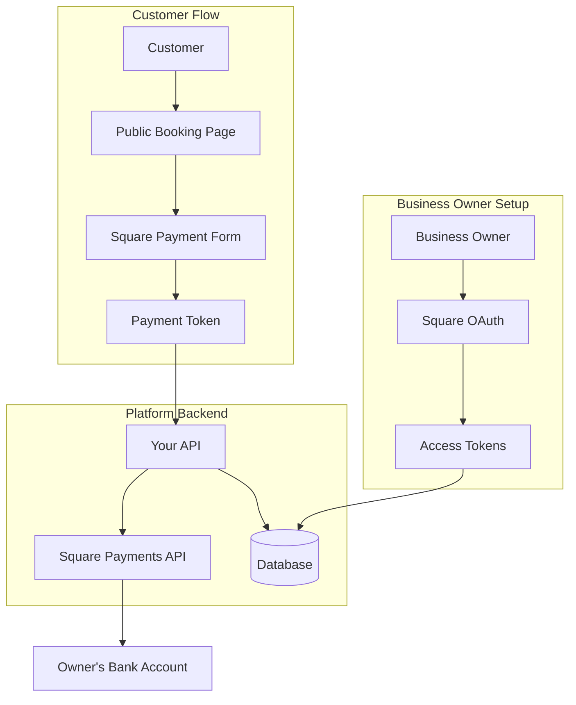

# Square Payment Integration Plan
## Multi-Tenant Scheduling Application

> **Document Created**: August 10, 2025  
> **Status**: Planning Phase  
> **Feasibility**: ✅ **Confirmed - Square fully supports multi-tenant applications**

---

## 📋 Executive Summary

Square payment processing can be successfully integrated into your scheduling application, allowing each business owner (user) to:
- Connect their own Square merchant account
- Accept payments directly on their scheduling pages
- Receive payments directly to their bank account
- Maintain complete control over their payment processing

### Key Benefits
- **Per-User Accounts**: Each business owner has their own Square merchant account
- **Direct Deposits**: Payments go directly to user's bank account (not platform)
- **Competitive Rates**: 2.6% + $0.10 per transaction (electronic), 3.5% + $0.15 (manual entry)
- **No Platform Fees**: Users pay Square directly, not through your platform
- **Full Feature Set**: Supports cards, digital wallets, ACH, recurring payments
- **PCI Compliance**: Square handles all payment security requirements
- **Mobile Optimized**: Works seamlessly on all devices

---

## 🏗️ Technical Architecture

### System Overview


### OAuth Flow for Multi-Tenant Setup
1. Business owner clicks "Connect Square" in dashboard
2. Redirected to Square authorization page
3. Owner logs into their Square account
4. Grants permissions to your application
5. Square redirects back with authorization code
6. Exchange code for access tokens
7. Store encrypted tokens per user

### Payment Processing Flow
1. Customer selects service and appointment time
2. Enters payment information via Square Web SDK
3. Square generates secure payment token
4. Backend processes payment using owner's Square account
5. Appointment created with payment confirmation
6. Confirmation emails sent to both parties

---

## 📝 Implementation Phases

### **Phase 1: Square OAuth Integration (Weeks 1-2)**

#### 1.1 Square Developer Setup
```
□ Create Square Developer account for platform
□ Register application in Square Developer Console
□ Obtain application ID and secret
□ Configure OAuth redirect URLs
□ Set up sandbox environment for testing
```

#### 1.2 Database Schema Updates
```sql
-- Add Square integration fields to users table
ALTER TABLE users ADD COLUMN square_access_token TEXT;
ALTER TABLE users ADD COLUMN square_refresh_token TEXT;
ALTER TABLE users ADD COLUMN square_merchant_id VARCHAR(255);
ALTER TABLE users ADD COLUMN square_location_id VARCHAR(255);
ALTER TABLE users ADD COLUMN square_connected_at TIMESTAMP;
ALTER TABLE users ADD COLUMN square_expires_at TIMESTAMP;
ALTER TABLE users ADD COLUMN payments_enabled BOOLEAN DEFAULT false;

-- Add pricing to services
ALTER TABLE services ADD COLUMN price DECIMAL(10,2);
ALTER TABLE services ADD COLUMN deposit_amount DECIMAL(10,2);
ALTER TABLE services ADD COLUMN payment_required BOOLEAN DEFAULT false;

-- Add payment tracking to appointments
ALTER TABLE appointments ADD COLUMN payment_status VARCHAR(50);
ALTER TABLE appointments ADD COLUMN payment_id VARCHAR(255);
ALTER TABLE appointments ADD COLUMN amount_paid DECIMAL(10,2);
ALTER TABLE appointments ADD COLUMN payment_date TIMESTAMP;
```

#### 1.3 OAuth Implementation
```typescript
// API Routes needed
POST   /api/square/connect       // Initiate OAuth flow
GET    /api/square/callback      // OAuth callback handler
GET    /api/square/status        // Check connection status
DELETE /api/square/disconnect    // Revoke Square access
POST   /api/square/refresh       // Refresh access token
```

---

### **Phase 2: Payment Processing Integration (Weeks 3-4)**

#### 2.1 Web Payments SDK Setup
```javascript
// Frontend: Initialize Square Web Payments SDK
const payments = Square.payments(applicationId, locationId);

// Create card payment method
const card = await payments.card();
await card.attach('#card-container');

// Generate payment token
const tokenResult = await card.tokenize();
```

#### 2.2 Payment API Endpoints
```typescript
// Payment processing endpoints
POST /api/payments/process
{
  token: string,          // Square payment token
  appointmentId: string,
  amount: number,
  customerId?: string
}

POST /api/payments/refund
{
  paymentId: string,
  amount?: number,        // Partial refund if specified
  reason: string
}

GET /api/payments/history
// Returns payment history for the user
```

#### 2.3 Webhook Handlers
```typescript
// Square webhook endpoints
POST /api/webhooks/square/payment
// Handle payment.created, payment.updated events

POST /api/webhooks/square/refund
// Handle refund.created, refund.updated events
```

---

### **Phase 3: UI Integration (Weeks 5-6)**

#### 3.1 Scheduling Page Builder Updates
```
Settings Tab Enhancements:
□ Payment toggle (enable/disable)
□ Service pricing configuration
□ Deposit settings
□ Tax rate configuration
□ Payment collection timing (immediate/later)
```

#### 3.2 Public Booking Page Updates
```typescript
// Component structure
<BookingPage>
  <ServiceSelection />
  <DateTimeSelection />
  <ClientInformation />
  {paymentsEnabled && (
    <PaymentSection>
      <PricingSummary />
      <SquarePaymentForm />
      <PaymentTerms />
    </PaymentSection>
  )}
  <BookingConfirmation />
</BookingPage>
```

#### 3.3 Dashboard Features
```
Payment Dashboard:
□ Today's payments summary
□ Transaction history table
□ Refund management
□ Payment status filters
□ Export to CSV functionality
```

---

### **Phase 4: Business Logic & Features (Weeks 7-8)**

#### 4.1 Service Pricing Models
```typescript
interface ServicePricing {
  type: 'fixed' | 'hourly' | 'custom';
  basePrice: number;
  depositRequired: boolean;
  depositAmount?: number;
  depositType?: 'fixed' | 'percentage';
  taxable: boolean;
  taxRate?: number;
}
```

#### 4.2 Payment States
```typescript
enum PaymentStatus {
  PENDING = 'pending',
  PROCESSING = 'processing',
  COMPLETED = 'completed',
  FAILED = 'failed',
  REFUNDED = 'refunded',
  PARTIALLY_REFUNDED = 'partially_refunded'
}
```

#### 4.3 Automated Workflows
```
□ Auto-confirm appointments on successful payment
□ Send payment receipts via email
□ Handle failed payment retries
□ Process refunds for cancellations
□ Update appointment status based on payment
```

---

## 🔒 Security & Compliance

### Security Requirements
```yaml
Required:
  - HTTPS for all payment pages
  - Content Security Policy headers
  - Encrypted token storage (AES-256)
  - Regular token rotation
  - Audit logging for all payment events

Compliance:
  - PCI DSS compliance via Square tokenization
  - No raw card data stored
  - Secure token transmission
  - Regular security audits
```

### Environment Variables
```env
# Square API Configuration
SQUARE_APPLICATION_ID=your_application_id
SQUARE_APPLICATION_SECRET=your_application_secret
SQUARE_ENVIRONMENT=sandbox|production
SQUARE_WEBHOOK_SIGNATURE_KEY=webhook_key

# OAuth Configuration
SQUARE_OAUTH_BASE_URL=https://connect.squareup.com
SQUARE_OAUTH_REDIRECT_URL=https://yourapp.com/api/square/callback

# Encryption
SQUARE_TOKEN_ENCRYPTION_KEY=your_encryption_key
```

---

## 💻 Technical Requirements

### Frontend Requirements
- **Browser Support**: Modern browsers (Chrome, Firefox, Safari, Edge)
- **No Support**: Internet Explorer 11
- **Mobile**: Fully responsive payment forms
- **Framework**: React/Next.js compatible
- **Security**: HTTPS required

### Backend Requirements
- **Node.js**: Version 18+ recommended
- **Square SDK**: `square` npm package
- **Database**: PostgreSQL with encryption support
- **Queue**: Background job processing for webhooks
- **Monitoring**: Payment event logging

### Square Web Payments SDK Features
```javascript
Supported Payment Methods:
✅ Credit/Debit Cards
✅ Apple Pay
✅ Google Pay
✅ ACH Bank Transfer
✅ Afterpay/Clearpay
✅ Cash App Pay
✅ Gift Cards

Localization:
✅ Automatic language detection
✅ 10+ supported languages
✅ Currency formatting
```

---

## 📊 Pricing & Fees

### Square Transaction Fees
| Payment Type | Fee Structure |
|-------------|--------------|
| Swiped/Inserted/Tapped | 2.6% + $0.10 |
| Manually Entered | 3.5% + $0.15 |
| Online/E-commerce | 2.9% + $0.30 |
| Invoices | 3.3% + $0.30 |
| ACH Bank Transfer | 1% (max $10) |

### Platform Considerations
- **No Monthly Fees**: Square has no monthly subscription
- **Instant Deposits**: Available for 1.75% fee
- **Standard Deposits**: Next business day (free)
- **Chargeback Fee**: $25 per dispute

---

## 🚀 Implementation Timeline

### Week 1-2: Foundation
```
□ Square developer account setup
□ Database schema updates
□ OAuth flow implementation
□ Basic connection testing
```

### Week 3-4: Payment Processing
```
□ Web Payments SDK integration
□ Payment API endpoints
□ Webhook handlers
□ Error handling & logging
```

### Week 5-6: UI Integration
```
□ Scheduling page payment settings
□ Public booking page updates
□ Payment form styling
□ Mobile responsiveness
```

### Week 7-8: Polish & Testing
```
□ Sandbox testing
□ Error scenarios
□ Refund flows
□ Documentation
□ Production deployment prep
```

---

## 📚 Resources & Documentation

### Square Developer Resources
- [Square Developer Portal](https://developer.squareup.com)
- [Web Payments SDK Documentation](https://developer.squareup.com/docs/web-payments/overview)
- [OAuth API Documentation](https://developer.squareup.com/docs/oauth-api/overview)
- [Payments API Reference](https://developer.squareup.com/reference/square/payments-api)
- [Webhook Events](https://developer.squareup.com/docs/webhooks-api/overview)

### Implementation Guides
- [Web Payments Quickstart](https://developer.squareup.com/docs/web-payments/quickstart)
- [OAuth Flow Guide](https://developer.squareup.com/docs/oauth-api/create-urls-for-square-authorization)
- [Testing in Sandbox](https://developer.squareup.com/docs/testing/sandbox)
- [Going Live Checklist](https://developer.squareup.com/docs/payments-api/go-live-checklist)

### Support Resources
- Square Developer Slack Community
- Stack Overflow: `square-connect` tag
- GitHub: Square SDK examples
- Square Developer Support

---

## ⚠️ Important Considerations

### Platform Requirements
1. **Square Account per User**: Each business owner needs their own Square account
2. **Onboarding Flow**: Clear instructions for Square account creation
3. **Geographic Availability**: Square is available in US, Canada, UK, Japan, Australia, and parts of Europe
4. **Business Verification**: Square may require business verification for new accounts

### Technical Considerations
1. **Rate Limits**: Square API has rate limits (varies by endpoint)
2. **Token Expiration**: Access tokens expire and need refresh
3. **Webhook Reliability**: Implement retry logic for failed webhooks
4. **Testing**: Extensive sandbox testing before production

### User Experience
1. **Setup Wizard**: Guide users through Square connection
2. **Payment Settings**: Intuitive configuration interface
3. **Error Messages**: Clear payment failure messaging
4. **Support Documentation**: Help articles for common issues

---

## 🎯 Success Metrics

### Key Performance Indicators
- OAuth connection success rate
- Payment processing success rate
- Average payment processing time
- Refund request rate
- User adoption rate of payment features

### Monitoring & Analytics
```
□ Payment success/failure rates
□ Average transaction amount
□ Popular payment methods
□ Peak payment processing times
□ Geographic payment distribution
```

---

## 📝 Next Steps

1. **Review & Approval**: Review this plan with stakeholders
2. **Square Account**: Create Square developer account
3. **Environment Setup**: Configure development environment
4. **Proof of Concept**: Build minimal OAuth flow
5. **Testing Strategy**: Define comprehensive test cases
6. **Security Review**: Conduct security assessment
7. **Implementation**: Begin Phase 1 development

---

## 🔄 Future Enhancements

### Potential Features
- Recurring payment subscriptions
- Payment plans and installments
- Multi-currency support
- Advanced reporting and analytics
- Loyalty program integration
- Gift card sales
- Tipping functionality
- Group payment splitting

### Integration Opportunities
- QuickBooks sync
- Tax calculation services
- Email marketing platforms
- Calendar integrations
- SMS payment reminders

---

*This document represents a comprehensive plan for integrating Square payments into the scheduling platform. Implementation should proceed with careful attention to security, user experience, and thorough testing.*